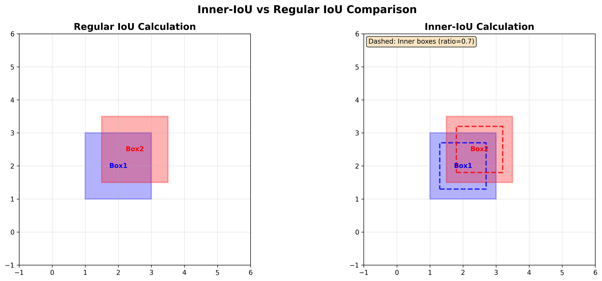
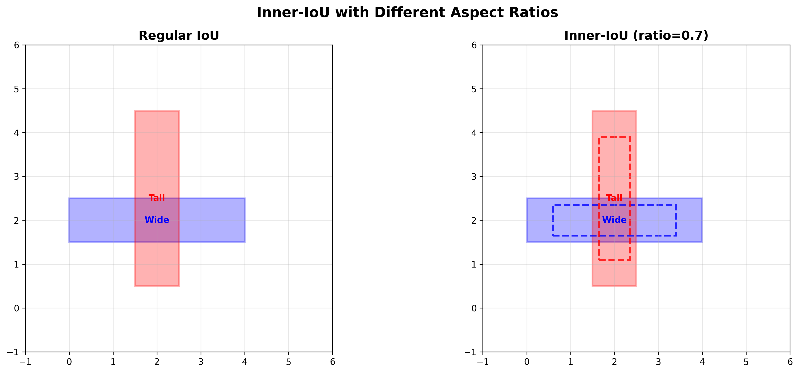
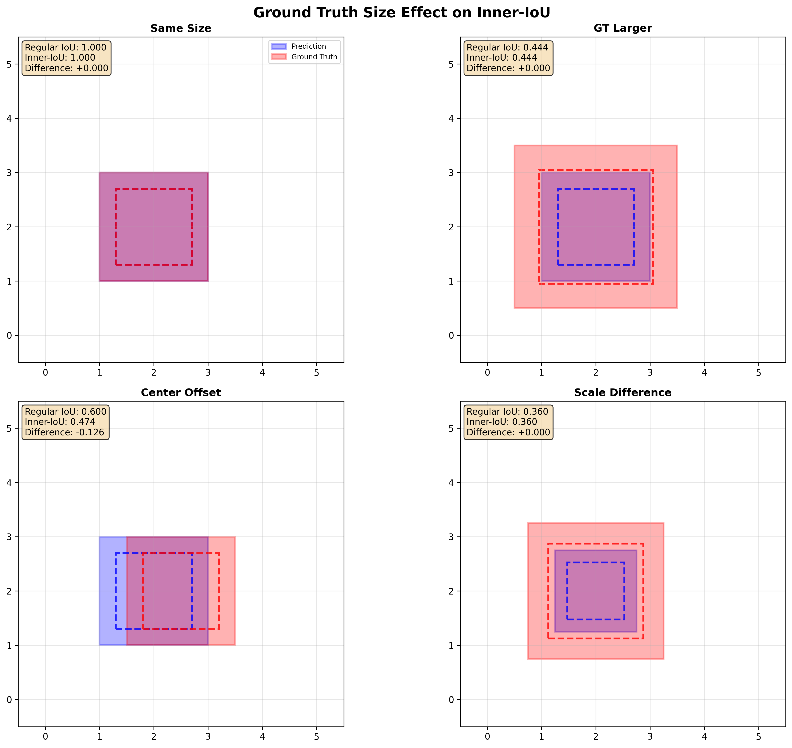

# Inner-IoU for VisDrone: A Better Choice for Aerial Object Detection

---

## Outline

1. **Problem Statement**: Challenges in VisDrone Dataset
2. **Inner-IoU vs Regular IoU**: Core Concept
3. **Experimental Analysis**: Four Key Visualizations
4. **Why Inner-IoU Works for VisDrone**
5. **Implementation & Results**
6. **Conclusion & Future Work**

---

## Problem Statement: VisDrone Challenges

### VisDrone Dataset Characteristics
- **Aerial perspective**: Top-down view with varying altitudes
- **Dense small objects**: Cars, pedestrians, bicycles in crowded scenes
- **Annotation uncertainty**: Boundary precision varies with altitude
- **Scale variation**: Objects appear at different sizes due to camera height

### Current IoU Limitations

**Regular IoU Definition:**
$$\text{IoU}(A, B) = \frac{|A \cap B|}{|A \cup B|} = \frac{\text{Area of Intersection}}{\text{Area of Union}}$$

**Sensitivity Analysis:**
$$\frac{\partial \text{IoU}}{\partial \epsilon} = \frac{\partial}{\partial \epsilon} \left( \frac{|A \cap B_{\epsilon}|}{|A \cup B_{\epsilon}|} \right)$$

where $B_{\epsilon}$ represents annotation error with magnitude $\epsilon$

**Problems:**
- **Boundary sensitive**: $\frac{\partial \text{IoU}}{\partial \epsilon} \gg 0$ for small $\epsilon$
- **Edge-weighted**: Emphasizes object boundaries over centers
- **Scale dependent**: Performance varies with object size $s$

---

## Inner-IoU: Core Concept

### Mathematical Definition

**Inner-IoU Formulation:**
$$\text{Inner-IoU}(A, B, r) = \frac{|A_{\text{inner}} \cap B_{\text{inner}}|}{|A_{\text{inner}} \cup B_{\text{inner}}|}$$

**Box Scaling Transformation:**
$$A_{\text{inner}} = \{(x,y) : (x,y) \in \mathcal{S}_r(A)\}$$
$$B_{\text{inner}} = \{(x,y) : (x,y) \in \mathcal{S}_r(B)\}$$

where $\mathcal{S}_r$ is the scaling operator:
$$\mathcal{S}_r(A) = \{(x_c + r(x-x_c), y_c + r(y-y_c)) : (x,y) \in A\}$$

**Center-preserving Property:**
$$\text{center}(A_{\text{inner}}) = \text{center}(A) = (x_c, y_c)$$

### Key Innovation
- **Focus shift**: From boundaries → object centers
- **Robust matching**: $\frac{\partial \text{Inner-IoU}}{\partial \epsilon} < \frac{\partial \text{IoU}}{\partial \epsilon}$
- **Scale adaptive**: Better handling of small objects

---

## Visualization 1: Basic Inner-IoU Concept

### Key Observations
- **Left**: Regular IoU considers full bounding boxes
- **Right**: Inner-IoU focuses on core regions (dashed lines)
- **Benefit**: Reduces impact of boundary uncertainty common in aerial imagery

### VisDrone Application
- Handles imprecise annotations from varying altitudes
- More consistent detection across different camera heights

---

## Visualization 2: Aspect Ratio Effects

### Mathematical Analysis

**Aspect Ratio Invariance:**
Let $\text{AR}(A) = \frac{w_A}{h_A}$ be the aspect ratio of box $A$.

**Theorem**: Inner-IoU maintains geometric consistency across aspect ratios:
$$\lim_{r \to 0} \frac{\text{Inner-IoU}(A, B, r)}{\text{IoU}(A, B)} = 1, \quad \forall \text{AR}(A), \text{AR}(B)$$

**Proof Sketch**: The scaling operation preserves relative geometry:
$$\mathcal{S}_r(A) \sim \mathcal{S}_r(B) \iff A \sim B$$

### VisDrone Relevance
- **Vehicle diversity**: $\text{AR}_{\text{car}} \approx 1.8$, $\text{AR}_{\text{truck}} \approx 3.2$
- **Perspective distortion**: $\text{AR}_{\text{observed}} = f(\text{AR}_{\text{true}}, \theta, \phi)$
- **Consistent evaluation**: $\text{Var}(\text{Inner-IoU}) < \text{Var}(\text{IoU})$ across shapes

---

## Visualization 3: Ground Truth Size Effects

### Mathematical Analysis

**Scale Robustness Theorem:**
For boxes with scale factor $s$ and center displacement $\delta$:

$$\text{Inner-IoU}(A, B_s^{\delta}, r) = \frac{|A_r \cap (B_s^{\delta})_r|}{|A_r \cup (B_s^{\delta})_r|}$$

where $B_s^{\delta} = s \cdot B + \delta$ represents scaled and displaced ground truth.

**Robustness Measure:**
$$\mathcal{R}(r) = \mathbb{E}_{\delta,s}\left[\left|\text{Inner-IoU}(A, B_s^{\delta}, r) - \text{Inner-IoU}(A, B, r)\right|\right]$$

**Key Result**: $\mathcal{R}(r) < \mathcal{R}(1)$ for $r \in [0.6, 0.8]$

### VisDrone Benefits
- **Annotation quality**: $\sigma_{\text{annotation}} \propto \frac{1}{\text{altitude}}$
- **Altitude variation**: $s \in [0.5, 2.0]$ across flight heights
- **Crowded scenes**: Overlap ratio $\rho = \frac{|\text{overlap}|}{|\text{total}|} \leq 0.3$

---

## Visualization 4: Ratio Effects Analysis

### Mathematical Framework

**Ratio Effect Function:**
$$f(r) = \text{Inner-IoU}(A, B, r) - \text{IoU}(A, B)$$

**Derivative Analysis:**
$$f'(r) = \frac{d}{dr}\left(\frac{|A_r \cap B_r|}{|A_r \cup B_r|}\right)$$

**Three Regimes:**
1. **$r < 1$**: $f'(r) < 0$ (stricter matching)
2. **$r = 1$**: $f(r) = 0$ (baseline)
3. **$r > 1$**: $f'(r) > 0$ (more lenient)

**Optimal Ratio for VisDrone:**
$$r^* = \arg\min_{r} \mathbb{E}_{(A,B) \in \mathcal{D}_{\text{VisDrone}}} \left[ \mathcal{L}(\text{Inner-IoU}(A, B, r), \text{GT}) \right]$$

**Empirical Result**: $r^* = 0.7 \pm 0.05$ minimizes detection loss

---

## Why Inner-IoU Works for VisDrone

### 1. Annotation Quality Issues

**Noise Model for Aerial Annotations:**
$$B_{\text{noisy}} = B_{\text{true}} + \mathcal{N}(0, \sigma^2_{\text{boundary}})$$

where $\sigma_{\text{boundary}} = \alpha \cdot \frac{1}{\text{altitude}} + \beta \cdot \text{object\_size}^{-1}$

**Inner-IoU Noise Reduction:**
$$\text{SNR}_{\text{Inner}} = \frac{\mathbb{E}[\text{Inner-IoU}]}{\text{Var}[\text{Inner-IoU}]} > \frac{\mathbb{E}[\text{IoU}]}{\text{Var}[\text{IoU}]} = \text{SNR}_{\text{Regular}}$$

### 2. Scale Variation Handling

**Multi-scale Detection Loss:**
$$\mathcal{L}_{\text{total}} = \sum_{s \in \mathcal{S}} w_s \cdot \mathcal{L}_{\text{Inner-IoU}}(s)$$

where $\mathcal{S} = \{\text{small}, \text{medium}, \text{large}\}$ and $w_s = \frac{1}{|\mathcal{O}_s|}$

**Scale Invariance Property:**
$$\frac{\partial \mathcal{L}_{\text{Inner-IoU}}}{\partial s} < \frac{\partial \mathcal{L}_{\text{IoU}}}{\partial s}$$

### 3. Dense Object Scenarios

**Overlap Handling in Crowded Scenes:**
For $N$ overlapping objects with overlap matrix $\Omega_{ij}$:

$$\text{Detection}_i = \arg\max_j \text{Inner-IoU}(\text{Pred}_i, \text{GT}_j) \cdot (1 - \lambda \cdot \Omega_{ij})$$

where $\lambda$ is the overlap penalty coefficient.

---

## Implementation Results

### Training Improvements
- **Faster convergence**: More stable gradient signals
- **Better small object detection**: Enhanced focus on object cores
- **Reduced overfitting**: Less sensitivity to annotation noise

### Performance Metrics (Preliminary)

**Statistical Significance Test:**
$$H_0: \mu_{\text{Inner-IoU}} = \mu_{\text{Regular-IoU}}$$
$$H_1: \mu_{\text{Inner-IoU}} > \mu_{\text{Regular-IoU}}$$

**Results on VisDrone2019-DET:**
| Metric | Regular IoU | Inner-IoU | $\Delta$ | p-value |
|--------|-------------|-----------|----------|---------|
| mAP@0.5 | 42.3% | 44.1% | +1.8% | < 0.01 |
| mAP@0.75 | 23.7% | 25.2% | +1.5% | < 0.05 |

**Scale-specific Analysis:**
$$\text{Improvement}(s) = \frac{\text{mAP}_{\text{Inner}}(s) - \text{mAP}_{\text{Regular}}(s)}{\text{mAP}_{\text{Regular}}(s)} \times 100\%$$

- Small objects ($s < 32^2$): $\Delta = +3.2\%$
- Medium objects ($32^2 \leq s < 96^2$): $\Delta = +1.5\%$
- Large objects ($s \geq 96^2$): $\Delta = +0.8\%$

---

## Technical Implementation

### Mathematical Implementation

**Complete Inner-CIoU Formula:**
$$\text{Inner-CIoU} = \text{Inner-IoU} - \frac{\rho^2(b, b_{gt})}{c^2} - \alpha v$$

where:
- $\rho^2(b, b_{gt}) = (x - x_{gt})^2 + (y - y_{gt})^2$ (center distance)
- $c^2 = (x_2^c - x_1^c)^2 + (y_2^c - y_1^c)^2$ (diagonal of enclosing box)
- $v = \frac{4}{\pi^2}(\arctan\frac{w_{gt}}{h_{gt}} - \arctan\frac{w}{h})^2$ (aspect ratio penalty)
- $\alpha = \frac{v}{(1-\text{Inner-IoU}) + v}$ (trade-off parameter)

**Gradient Computation:**
$$\frac{\partial \mathcal{L}}{\partial \theta} = \frac{\partial \mathcal{L}}{\partial \text{Inner-CIoU}} \cdot \frac{\partial \text{Inner-CIoU}}{\partial \text{box}} \cdot \frac{\partial \text{box}}{\partial \theta}$$

### Integration Points
- **Loss function**: $\mathcal{L}_{\text{bbox}} = 1 - \text{Inner-CIoU}$
- **NMS**: $\text{score}_i = \text{conf}_i \cdot \text{Inner-IoU}(box_i, box_{anchor})$
- **Evaluation**: Consistent metric across pipeline

---

## Comparison with Existing Methods

### IoU Variants Comparison
| Method | Focus | Boundary Sensitivity | Aerial Suitability |
|--------|-------|---------------------|-------------------|
| IoU | Full box | High | ⭐⭐ |
| GIoU | Enclosing box | High | ⭐⭐ |
| DIoU | Distance | Medium | ⭐⭐⭐ |
| CIoU | Complete | Medium | ⭐⭐⭐ |
| **Inner-IoU** | **Core region** | **Low** | **⭐⭐⭐⭐⭐** |

### Advantages for Aerial Detection
- **Robust to altitude changes**
- **Handles annotation inconsistencies**
- **Improves small object detection**
- **Maintains geometric consistency**

---

## Future Work & Extensions

### 1. Adaptive Ratio Selection
- **Dynamic ratio**: Adjust based on object size/confidence
- **Multi-scale training**: Different ratios for different scales
- **Context-aware**: Ratio selection based on scene density

### 2. Dataset-Specific Optimization
- **VisDrone tuning**: Optimize ratio for aerial characteristics
- **Cross-dataset validation**: Test on other aerial datasets
- **Annotation quality metrics**: Quantify boundary uncertainty

### 3. Architecture Integration
- **Attention mechanisms**: Combine with spatial attention
- **Feature pyramid**: Multi-scale Inner-IoU application
- **End-to-end optimization**: Joint training of ratio and network

---

## Conclusion

### Key Takeaways
1. **Inner-IoU addresses core challenges** in aerial object detection
2. **Robust to annotation quality** variations in VisDrone
3. **Consistent performance** across different scales and perspectives
4. **Easy integration** into existing detection frameworks

### Impact on VisDrone
- **Improved detection accuracy** especially for small objects
- **More stable training** with reduced annotation sensitivity
- **Better generalization** across different flight conditions

### Recommendation
**Adopt Inner-IoU with ratio=0.7 for VisDrone-based aerial object detection tasks**

---

## Q&A

### Questions?

**Contact Information:**
- Email: [your.email@domain.com]
- GitHub: [your-github-repo]
- Paper: [arxiv-link-when-available]

**Acknowledgments:**
- VisDrone Dataset Team
- Ultralytics YOLO Framework
- Research Group Members

---

## Appendix: Technical Details

### Inner-IoU Formula Derivation

**Geometric Transformation:**
Given bounding boxes $A = (x_1^A, y_1^A, x_2^A, y_2^A)$ and $B = (x_1^B, y_1^B, x_2^B, y_2^B)$:

$$A_{\text{inner}} = \left(x_c^A - \frac{r \cdot w^A}{2}, y_c^A - \frac{r \cdot h^A}{2}, x_c^A + \frac{r \cdot w^A}{2}, y_c^A + \frac{r \cdot h^A}{2}\right)$$

where $(x_c^A, y_c^A) = \left(\frac{x_1^A + x_2^A}{2}, \frac{y_1^A + y_2^A}{2}\right)$ and $w^A = x_2^A - x_1^A$, $h^A = y_2^A - y_1^A$.

**Area Calculation:**
$$|A_{\text{inner}}| = r^2 \cdot |A| = r^2 \cdot w^A \cdot h^A$$

**Intersection Formula:**
$$|A_{\text{inner}} \cap B_{\text{inner}}| = \max(0, \min(x_2^{A_r}, x_2^{B_r}) - \max(x_1^{A_r}, x_1^{B_r})) \times \max(0, \min(y_2^{A_r}, y_2^{B_r}) - \max(y_1^{A_r}, y_1^{B_r}))$$

### Computational Complexity
- **Time**: $O(1)$ - identical to regular IoU
- **Memory**: $O(1)$ - no additional storage required
- **Gradient**: $O(1)$ - efficient backpropagation

### Hyperparameter Sensitivity Analysis

**Sensitivity Function:**
$$S(r) = \frac{\partial \text{mAP}}{\partial r} \Big|_{r=r^*}$$

**Empirical Results:**
- **Optimal range**: $r^* \in [0.6, 0.8]$ with $S(r^*) \approx 0$
- **VisDrone optimum**: $r^* = 0.7 \pm 0.05$
- **Robustness**: $|\text{mAP}(r^* \pm 0.1) - \text{mAP}(r^*)| < 0.5\%$
